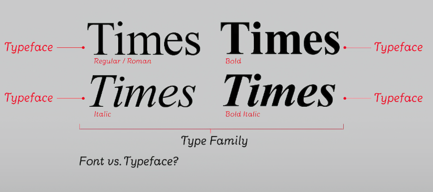
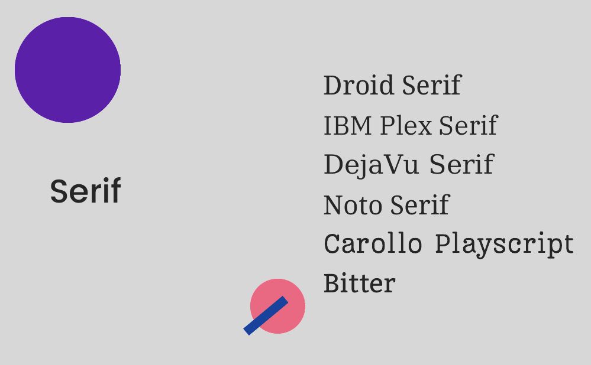
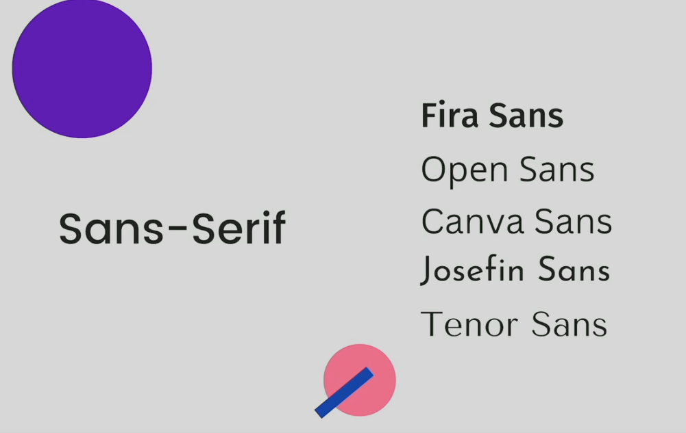

## Fonts



First off, a **Typeface** is actually the name of a font
A font is a changed in the size, **weight** or _style_ or whatever in a Type Face.

It's Steve Jobs fault, he decided to call them fonts and it stuck.

### Font Families

The font family property is used to specify the font of an element. The font family can be a list of fonts separated by commas. If the first font is not available, the browser will try the next font in the list.

```css
p {
  font-family: Arial, sans-serif;
}

* {
  font-family: "Times New Roman", serif;
}
```

It is important to note that the font family property is inherited by child elements. If a child element does not have a font family specified, it will inherit the font family from its parent element.

**It is good practice to**:

1. Quote font names that contain spaces or special characters.
2. Include a generic font family at the end of the list. This ensures that if none of the specified fonts are available, the browser will use a generic font.

**Generic font families include**:

- `serif`: Fonts with serifs (small lines at the ends of characters, glyphs have finishing strokes, flared/tapered endings or have actual serifed endings).
- `sans-serif`: Fonts without serifs.
- `monospace`: Fonts where each character takes up the same amount of space.
- `cursive`: Fonts that mimic handwriting.
- `fantasy`: Decorative fonts.
- `system-ui`: The default system font.





**CSS font family names are not case sensitive**. However, it is a good practice to use the exact case as specified by the font creator, especially for font names that are more than one word long.

This is because some systems may interpret the font names differently. For example, "Times New Roman" is typically the correct capitalization.

### Font Weight

The font weight property is used to specify the weight of the font. The weight can be specified using a keyword or a number.

```css
p {
  font-weight: normal;
  font-weight: bold;
  font-weight: 400;
  font-weight: inherit;
}
```

There are nine weight values that can be used. The default weight of the font is typically `normal`.

There are word key values that can be used to specify the weight:

- `normal`: The default weight of the font.
- `bold`: A bold weight font.
- `bolder`: A weight that is bolder than the parent element.
- `lighter`: A weight that is lighter than the parent element.

There are four additional global key values to pass or reset the weight:

- `inherit`: The weight of the font is inherited from the parent element.
- `initial`: Sets the weight to its default value.
- `unset`: Resets the weight to its inherited value.
- `revert`: Resets the weight to its parent value.

There are numeric key values that can be used to more granularly adjust the weight:

- `100`: Thin.
- `200`: Extra Light (Ultra Light).
- `300`: Light.
- `400`: Normal.
- `500`: Medium.
- `600`: Semi Bold (Demi Bold).
- `700`: Bold.
- `800`: Extra Bold (Ultra Bold).
- `900`: Black (Heavy).

### Font Size

The font size property is used to specify the size of the font. The size can be specified using a keyword, a percentage, or a length value.

```css
p {
  font-size: medium; /* 16px */
  font-size: 16px; /* 16 pixels */
  font-size: 1em; /* 16 pixels */
  font-size: 100%; /* 16 pixels */
  font-size: 1.5rem; /* 24 pixels */
}
```

**Font Size Values**

- **length**: These are absolute units and are not affected by the parent element's font size.

  - `px`: Pixels, a dot on the computer screen.
  - `pt`: Points, traditionally used in print. 1pt = 1/72 of an inch.
  - `cm`, `mm`, `in`: Centimeters, millimeters, inches. Typically used in print.
  - `pc`: Picas, traditionally used in print. 1pc = 12 points.

- **relative**: These units are relative to another length value. (_recommended for accessibility reasons_)

  - `em`: Relative to the font-size of the nearest parent.
  - `rem`: Relative to the font-size of the root element. (html)
  - `%`: Relative to the parent element's font size.
  - `smaller` and `larger`: Relative to the parent's font size.

- **absolute**: These are absolute sizes mapped to specific pixel values, not affected by the parent element's font size. (_not recommended for accessibility reasons as it is based off each device's default font size_)

  - `xx-small`, `x-small`, `small`, `medium`, `large`, `x-large`, `xx-large`: These are set sizes that have been predefined by the browser.

- **global**: These are keywords that inherit or reset values.

  - `inherit`: Takes the same computed value as the property for the element's parent.
  - `initial`: Sets the property to its default value.
  - `unset`: Acts like `inherit` if the property is inherited and `initial` otherwise.
  - `revert`: Resets the property to the value it would have had if no changes had been made to the element's styling.

- **viewport**: These units are relative to the size of the viewport.
  - `vw`: 1% of the viewport's width.
  - `vh`: 1% of the viewport's height.
  - `vmin`: 1% of the viewport's smaller dimension (height or width).
  - `vmax`: 1% of the viewport's larger dimension (height or width).

Example:

```css
html {
  font-size: 16px;
}

p {
  font-size: 2em; /* 16px * 2em = 32 pixels */
}

div {
  font-size: 1.5em; /* 16 * 1.5em = 24 pixels */
}

h1 {
  font-size: 120%; /* 16 * 1.2 = 19.2 pixels */
}
```

### Text Decoration

Sets the appearance of decorative lines on text and is shorthand for the following properties:

- `text-decoration-line`: The type of line to display.
- `text-decoration-color`: The color of the line.
- `text-decoration-style`: The style of the line.
- `text-decoration-thickness`: The thickness of the line.

```css
/* Instead of this... */
p {
  text-decoration-line: underline;
  text-decoration-color: red;
  text-decoration-style: wavy;
  text-decoration-thickness: 2px;
}

/* ...you can use this */
p {
  text-decoration: underline red wavy 2px;
}
```

```css
p {
  text-decoration: underline;
  text-decoration: underline overline;
  text-decoration: underline overline line-through;
  text-decoration: underline overline line-through wavy;
}
```
